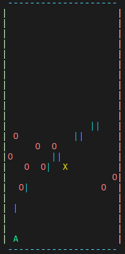

# Asteroid Blaster

Terminal-based asteroid blaster game for the TM4C123GH6PM microcontroller. Runs on bare-metal firmware with no OS. Game logic is driven by a 1 Hz timer interrupt, and input is handled via UART.

## Gameplay

- Asteroids spawn at random positions near the top of the board and fall down each game tick
- Move your ship left and right to avoid them, and shoot bullets to destroy them
- **Controls:** `a` move left, `d` move right, `space` shoot
- Each level starts with 10 asteroids. You must destroy at least one to advance
- If all asteroids escape without you hitting any, or an asteroid reaches your ship, it's game over
- Each new level the game speed doubles (timer period halves)

<p align="center">                            
                                                 
</p> 

## How It Works

The game uses a dual-interrupt architecture:

- **TIMER0 (1 Hz):** fires every second, sets a `timer_ticked` flag
- **Main loop:** on each tick, moves bullets up, moves asteroids down, checks collisions, renders entities
- **UART0 interrupt:** fires on keypress, moves the ship or spawns a bullet immediately (faster than the 1 Hz tick)

The main loop disables interrupts during game state updates to prevent race conditions.

The board is rendered using VT100 escape sequences over UART and only changed cells are redrawn each tick to avoid flickering.

## Hardware

- **MCU:** TM4C123GH6PM (ARM Cortex-M4, 16 MHz)
- **UART0:** PA0 (RX) / PA1 (TX) at 9600 baud
- **TIMER0:** 32-bit periodic mode, 1 Hz game tick
- **Red LED (PF1):** blinks on game over

## Quick Start

1. Open `Asteroid_Blaster.uvprojx` in Keil uVision 5
2. Build and flash to TivaC LaunchPad
3. Open a serial terminal (PuTTY, Tera Term) at **9600 baud**
4. Terminal must support VT100 escape sequences

> **Note:** Comment out the clock configuration line in `RTE/Device/TM4C123GH6PM/system_TM4C123.c` before building.

## Project Structure

```
main.c              — game loop
app/                — game logic (game, render, collision)
entities/           — ship, bullet, asteroid behaviour
drivers/            — UART, timer, GPIO peripheral drivers
hal/                — UART output abstraction (cursor, VT100)
config/             — constants, board string, prompt strings
lib/                — utility functions (int2string, delay, counters)
```
